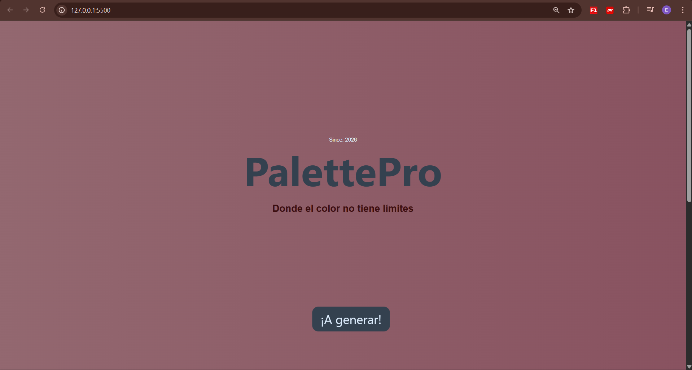

PalettePro

Aplicación web interactiva que genera paletas de colores aleatorias en formato HEX y HSL, permitiendo seleccionar la cantidad de colores y copiar códigos fácilmente.

-----------------------------------------------------------------------------------------------------------------------------------------------------------

Demo

🔗 (Aquí irá el link de GitHub Pages)

-----------------------------------------------------------------------------------------------------------------------------------------------------------

Funcionalidades

* Generación de colores aleatorios
* Soporte para formatos HEX y HSL
* Selección dinámica de cantidad (6, 8 o 9 colores)
* Copia al portapapeles al hacer clic en un color
* Microfeedback visual al generar paleta
* Diseño responsive (adaptable a móvil y tablet)

-----------------------------------------------------------------------------------------------------------------------------------------------------------

Tecnologías utilizadas

* HTML5
* CSS3
* JavaScript (Vanilla)

-----------------------------------------------------------------------------------------------------------------------------------------------------------

Cómo ejecutar el proyecto

1. Clonar el repositorio:

-----------------------------------------------------------------------------------------------------------------------------------------------------------
git clone <tu-link>

2. Abrir el archivo `index.html` en el navegador

-----------------------------------------------------------------------------------------------------------------------------------------------------------

Decisiones técnicas

* Se utilizó `flexbox` para la distribución de los colores
* Se implementó `Math.random()` para la generación de colores
* Se manipuló el DOM para renderizar dinámicamente los elementos
* Se evitó el uso de librerías externas para reforzar lógica base

-----------------------------------------------------------------------------------------------------------------------------------------------------------

Responsive Design

Se implementaron media queries para adaptar la interfaz a diferentes tamaños de pantalla.

-----------------------------------------------------------------------------------------------------------------------------------------------------------

Capturas

()

-----------------------------------------------------------------------------------------------------------------------------------------------------------

Mejoras futuras

* Bloqueo de colores
* Guardado de paletas en localStorage
* Exportación de paletas

-----------------------------------------------------------------------------------------------------------------------------------------------------------
