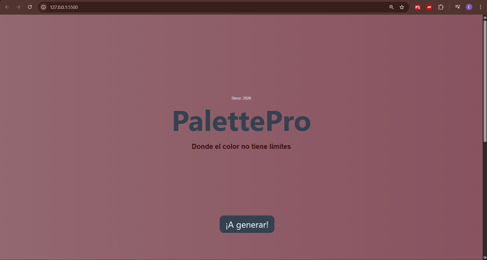
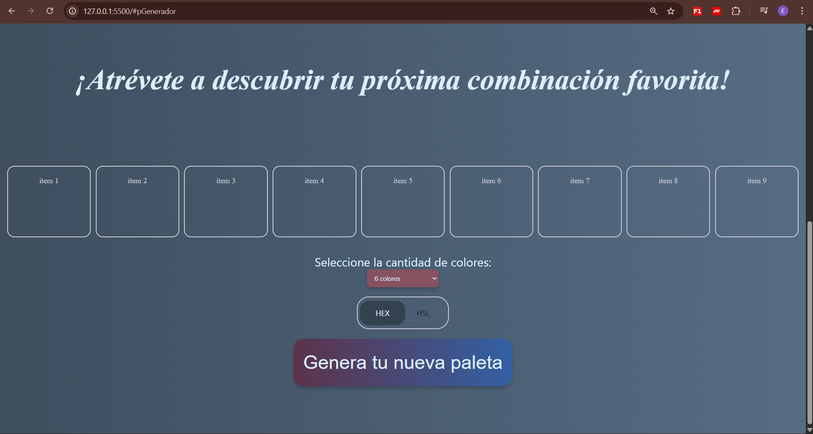

# PalettePro

PalettePro es una aplicación web para generar paletas de color aleatorias con un estilo visual moderno, una interfaz interactiva y un fondo animado con efecto de fluido. Permite explorar combinaciones de colores, elegir el formato de salida y copiar cada código de color al portapapeles con un solo clic.

## Demo

https://proyecto-m1-emanuel-florez.vercel.app/

## Descripción

La idea principal del proyecto es ofrecer una herramienta ligera, visualmente atractiva y fácil de usar para crear combinaciones cromáticas útiles para diseño, branding, mockups o inspiración creativa. La app combina HTML, CSS y JavaScript puro, junto con una simulación de fluidos en WebGL para darle un toque distintivo a la experiencia.

## Características principales

- Generación aleatoria de colores en formato HEX y HSL.
- Selección de 6, 8 o 9 colores por paleta.
- Copia rápida de cada código al hacer clic sobre una muestra.
- Feedback visual al crear una nueva combinación.
- Menú desplegable personalizado para elegir la cantidad de colores.
- Toggle animado para cambiar entre HEX y HSL.
- Botón principal con efecto líquido reactivo al movimiento del cursor.
- Fondo de pantalla con simulación de fluido arcoíris y partículas de tinta.
- Interfaz responsive adaptada para escritorio, tablet y móvil.

## Tecnologías utilizadas

- HTML5
- CSS3
- JavaScript vanilla
- WebGL
- GLSL shaders
- Canvas 2D para efectos complementarios

No se usan librerías externas para la lógica principal ni para la simulación del fondo.

## Estructura del proyecto

```text
ProyectoM1_EmanuelFlórez/
├── index.html
├── README.md
├── css/
│   ├── components.css
│   ├── responsive.css
│   ├── style.css
│   └── variables.css
├── js/
│   ├── fluid.js
│   └── script.js
├── docs/
│   ├── index.html
│   ├── script.js
│   └── style.css
├── Documentacion/
│   └── capturas/
└── .git/
```

### Archivos clave

- [index.html](index.html): estructura principal de la interfaz.
- [js/script.js](js/script.js): lógica de generación de colores, manejo del menú, cambio de modo y copia al portapapeles.
- [js/fluid.js](js/fluid.js): simulación visual del fondo con WebGL y efecto de fluido.
- [css/style.css](css/style.css): estilos globales, fondo negro y layout general.
- [css/components.css](css/components.css): componentes visuales como botones, metadatos, menú y paleta.
- [css/responsive.css](css/responsive.css): ajustes para pantallas pequeñas.

## Instalación y ejecución local

1. Clona el repositorio:

```bash
git clone <url-del-repositorio>
```

2. Accede a la carpeta del proyecto:

```bash
cd ProyectoM1_EmanuelFlórez
```

3. Abre el archivo `index.html` en tu navegador, o usa una extensión como Live Server en VS Code para ejecutarlo en un entorno local.

> Se recomienda usar un navegador moderno con soporte para WebGL.

## Cómo usar la app

1. Elige la cantidad de colores con el menú desplegable.
2. Selecciona el formato: HEX o HSL.
3. Haz clic en el botón principal para generar una nueva paleta.
4. Presiona cualquier muestra de color para copiar el código al portapapeles.
5. Explora la experiencia visual del fondo líquido mientras te desplazas por la página.

## Personalización del efecto de fluido

En [js/fluid.js](js/fluid.js) hay una configuración central llamada `fluidConfig` que permite ajustar la sensación del fondo animado:

```js
const fluidConfig = {
    enabled: true,
    resolutionScale: 0.55,
    velocityDissipation: 0.985,
    mouseForce: 2.4,
    splatRadius: 0.001,
    pressureIterations: 12,
    trailSeconds: 2
};
```

### Parámetros principales

- `enabled`: activa o desactiva la simulación.
- `resolutionScale`: ajusta la calidad visual y el rendimiento.
- `velocityDissipation`: controla la duración del movimiento del líquido.
- `mouseForce`: modifica la intensidad del empuje generado por el cursor.
- `splatRadius`: define el tamaño de la tinta inyectada.
- `pressureIterations`: aumenta o reduce la precisión del flujo.
- `trailSeconds`: controla la duración de la estela de color.

## Decisiones técnicas

- Se utiliza Flexbox para estructurar la interfaz y las muestras de color.
- Los estilos reutilizables están centralizados en variables CSS.
- La experiencia visual se apoya en una simulación GPU con WebGL para mantener un rendimiento más fluido.
- El fondo de fluido no añade nodos DOM por cada movimiento, lo que ayuda a mantener una interfaz ligera.
- El diseño preserva el contenido principal por encima del canvas mediante capas y `z-index`.

## Capturas





## Mejoras futuras

- Bloquear colores individuales dentro de la paleta.
- Guardar paletas favoritas en localStorage.
- Exportar combinaciones en formatos JSON o PNG.
- Añadir controles visuales para ajustar la intensidad del fluido.
- Implementar fallback para navegadores sin soporte WebGL.

## Licencia

Este proyecto se entrega como trabajo de desarrollo web personal y puede adaptarse o reutilizarse libremente con fines educativos o demostrativos.
